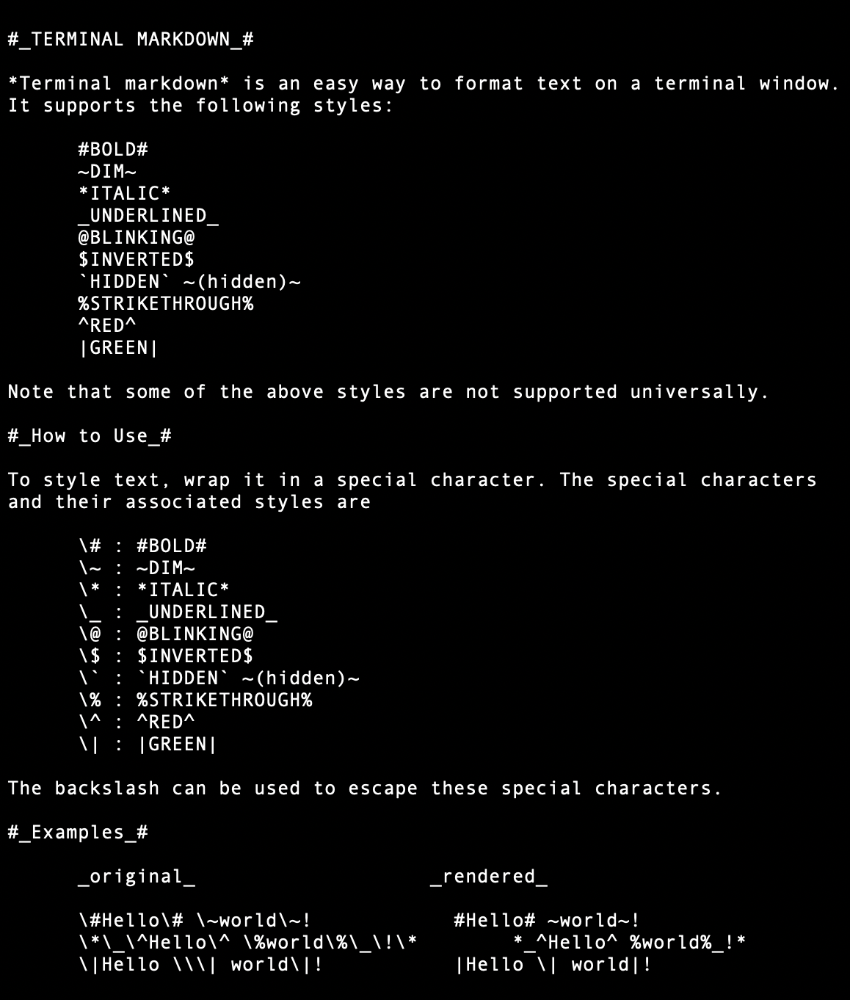
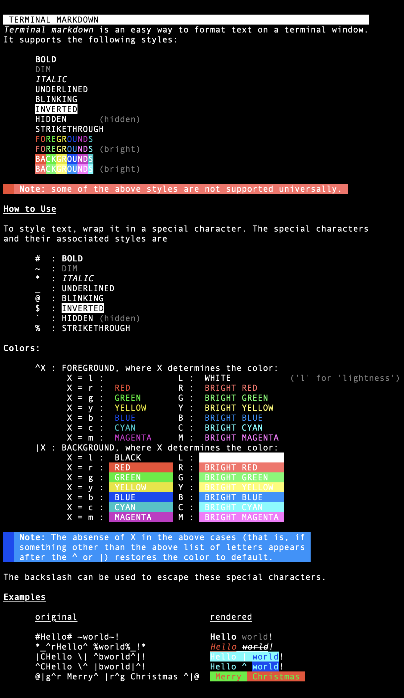

# Terminal Markdown

## What is it?

Terminal markdown is a simple formatting tool for displayng text on a UNIX-like terminal emulator. It allows you to easily create text that is

- Bold
- Dim
- Italic
- Underlined
- Blinking
- Inverted
- Hidden
- Striked through

As well as text with a foreground and/or background color that is

- Black
- White
- Red
- Green
- Yellow
- Blue
- Magenta
- Cyan

and render it on a terminal emulator.

It will render a file like this:



like this:



(In this screenshot you can't see the `BLINKING` text actually blink, and the `HIDDEN` text isn't hidden because of my particular terminal emulator.)

Note that some of the above styles are not supported everywhere. Particulary italic, blinking, and hidden.

## How do I try it?

To get started, type the following into your terminal:

```zsh
% git clone https://github.com/Evoniuk/terminal-markdown.git
% cd terminal-markdown
% make tmd && ./tmd intro.tmd
```

If everything works right, this will display a brief tutorial on how to use terminal markdown.

You can also try calling `tmd --help` or `tmd -h`.

## How do I use it?

Terminal markdown works much like markdown. Text is styled by wrapping it in special characters.

The association of characters to styles is

```
# Bold
~ Dim
* Italic
_ Underline
@ Blinking
$ Inverted
` Hidden
% Strikethrough
^ Foreground
| Background
```

So, for example, if you type the following into your terminal:

```zsh
% echo '#Hello# *World*!' | tmd
```

you'll get the following displayed on the terminal:

> **Hello** *World*!

Piping allows combination with other programs:

```zsh
% cat intro.tmd | tmd
% curl https://raw.githubusercontent.com/Evoniuk/terminal-markdown/master/intro.tmd | tmd
```

For longer text it might be easier to put your text into files and call tmd like so:

```zsh
% tmd file1 file2 ...
```

### Use it as a C library

To make use of tmd within your own programs, you can `#include tmd.h` and compile with `tmd.c`.

This will expose two functions:

- `void format_and_print(char* text, bool format)`
- `char* substitute_escapes(char* text, bool format)`

`void format_and_print(char* text, bool format)` will print and format your text if `format` is `true`. It will print unformatted text (the same text but without any styling) if `format` is `false`.

`char* substitute_escapes(char* text, bool format)` will return the formatted version of `text` if `format` is `true`, and the unformatted version if `format` is `false`. The return value of this function must be `free`'d.

## How does it work?

For the internals, all that's going on is a substitution of certain characters with certain escape sequences.

The first time the programs sees a special character, it substitutes it for an escape sequence according to the following:

```
Special Character       Escape Sequence         Style to Begin
-----------------       ---------------         --------------
#                       \e[1m                   bold
~                       \e[2m                   dim
*                       \e[3m                   italic
_                       \e[4m                   underline
@                       \e[5m                   blink
$                       \e[7m                   inverted
`                       \e[8m                   hidden
%                       \e[9m                   strikethrough
^x                      \e[30m  - \e[36m        foreground
^X                      \e[91m  - \e[97m        light foreground
|x                      \e[40m  - \e[46m        background
|X                      \e[101m - \e[107m       light background
```

This escape sequence tells the terminal to start the associated style.

The next time the special character is seen, this substitution takes place:

```
Special Character       Escape Sequence         Style to End
-----------------       ---------------         ------------
#                       \e[22m                  bold
~                       \e[22m                  dim
*                       \e[23m                  italic
_                       \e[24m                  underline
@                       \e[25m                  blink
$                       \e[27m                  inverted
`                       \e[28m                  hidden
%                       \e[29m                  strikethrough
^                       \e[39m                  foreground
|                       \e[49m                  background
```

This escape sequence tells the terminal to end the associated style.

A backslash skips over the interpretation of the susbsequent character.
